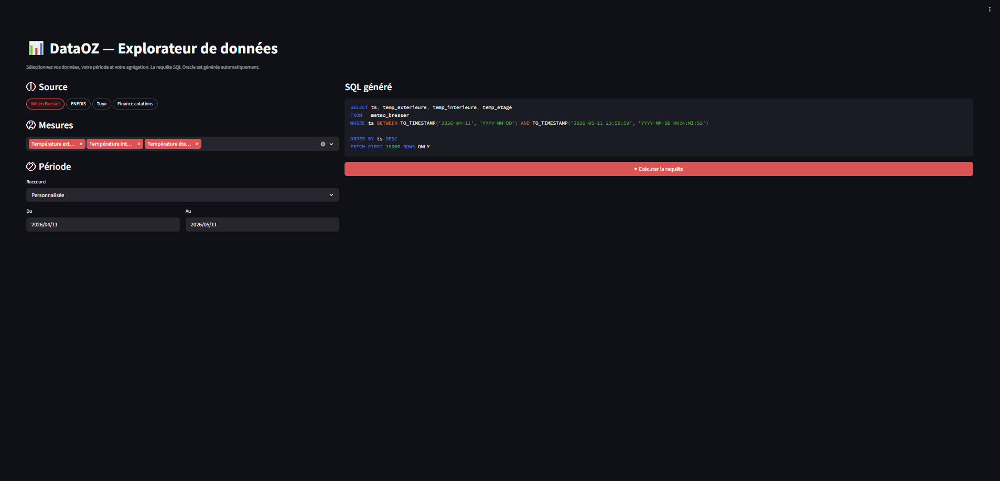
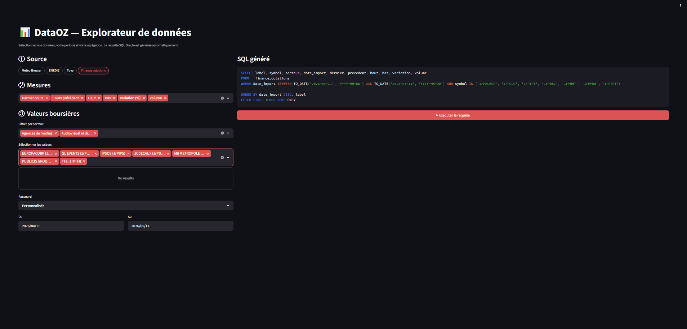
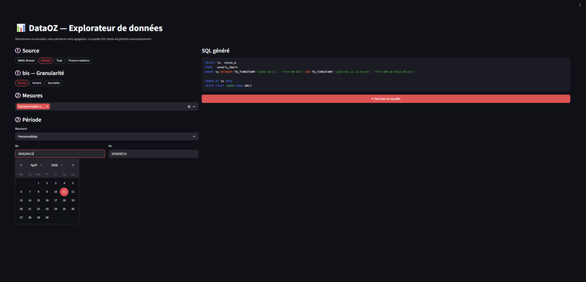
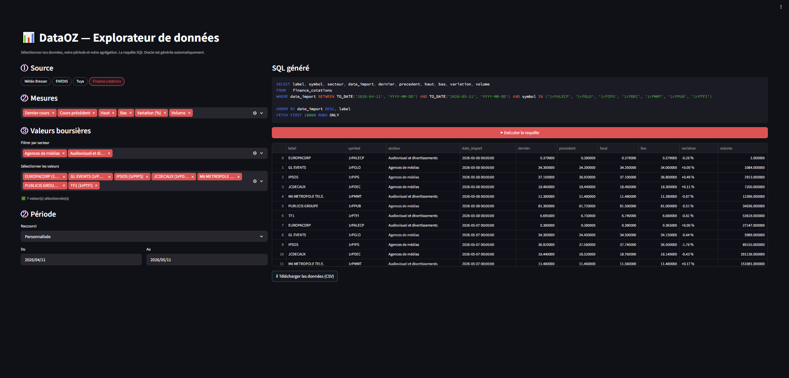

# DataOZ — Pipeline de données personnel end-to-end

> Collecte, transformation, stockage cloud et visualisation de données énergétiques, météo et financières — orchestré par Apache Airflow, hébergé sur Oracle Cloud Infrastructure.

---

## Table des matières

1. [Vue d'ensemble](#vue-densemble)
2. [Interface Streamlit — Explorateur SQL](#interface-streamlit--explorateur-sql)
3. [Architecture](#architecture)
4. [Sources de données](#sources-de-données)
5. [Stack technique](#stack-technique)
6. [Structure du pipeline](#structure-du-pipeline)
7. [Composants principaux](#composants-principaux)
8. [Monitoring intégral](#monitoring-intégral)
9. [Déploiement](#déploiement)
10. [Résultats](#résultats)
11. [Points techniques notables](#points-techniques-notables)

---

## Vue d'ensemble

DataOZ est un projet personnel de **data engineering end-to-end** conçu pour collecter, transformer et exploiter des données hétérogènes issues de sources variées (capteurs IoT, fournisseurs d'énergie, API financières, stations météo).

Le pipeline va de la collecte brute jusqu'à l'exploration interactive via une application web, en passant par un stockage cloud managé.

**Objectifs :**
- Centraliser dans une base de données cloud des données fragmentées (capteurs, fichiers, sites web)
- Automatiser l'ensemble de la chaîne avec zéro intervention manuelle au quotidien
- Exposer les données via une interface SQL interactive accessible depuis n'importe où
- Valider l'intégrité de la chaîne complète avec un DAG de monitoring déclenché automatiquement

---

## Interface Streamlit — Explorateur SQL

L'application est accessible publiquement sur **[https://sql-database.dataoz.fr](https://sql-database.dataoz.fr)**.

Elle permet de requêter interactivement toutes les tables Oracle sans écrire de SQL : les requêtes sont générées automatiquement à partir des sélections de l'utilisateur.

### Démarche en 4 étapes

**Étape 1 — Sélection de la source de données**

Choisir la source via des étiquettes cliquables (`st.pills`) : Météo Bresser, ENEDIS, Tuya, Finance cotations. Pour ENEDIS et Tuya, une granularité est ensuite sélectionnée (30 min / Horaire / Journalier).



**Étape 2 — Sélection des données**

Choisir les mesures à inclure dans la requête (colonnes du SELECT). Pour Finance cotations, un filtre par secteur permet de cibler les valeurs boursières souhaitées, avec un compteur du nombre de titres sélectionnés.



**Étape 3 — Sélection de la période**

Définir la plage temporelle via des raccourcis prédéfinis (7 jours, 30 jours, YTD…) ou un calendrier intégré pour des dates personnalisées.




**Étape 4 — Exécution de la requête SQL**

La requête Oracle est générée automatiquement et affichée avant exécution. Les résultats s'affichent dans un tableau exportable en CSV.



---

## Architecture


### Frontend — Streamlit + IONOS

L'interface utilisateur est hébergée sur une **VM OCI Compute** (Ubuntu 22.04, Always Free) et exposée via le domaine `sql-database.dataoz.fr` géré chez **IONOS** (enregistrement DNS de type A vers l'IP publique de la VM). Le certificat HTTPS est émis via Let's Encrypt et le service Streamlit tourne en permanence via `systemd`. La connexion à Oracle ADB s'effectue directement depuis la VM via `python-oracledb` en mode thin (wallet mTLS) — aucun middleware applicatif interposé.

### Backend — Architecture data

Le backend est entièrement **piloté par fichiers** : les données transitent en CSV (PC local → bucket OCI) et sont chargées dans Oracle par `DBMS_SCHEDULER` (DBTIMEZONE UTC — `BYHOUR=2` = 02h00 UTC = **04h00 CEST**) sans serveur applicatif exposé. L'orchestration est assurée par Apache Airflow en local sous Docker.

---

## Sources de données

### Consommation électrique — Tuya / SmartLife
- **API** : Tuya Cloud API (Beta), statistique `add_ele`
- **Appareils** : prises connectées SmartLife mesurant la consommation par appareil
- **Granularités** : 15 minutes, horaire, journalier, mensuel
- **Collecte** : quotidienne à 02h00 UTC, historique complet depuis l'origine

### Consommation électrique — Enedis
- **Canal B** : intégration manuelle de fichiers XLSX déposés dans un inbox (`inbox_enedis/`) — priorité haute, les données manuelles écrasent le scraping en cas de doublon
- **Canal C** : scraping automatique via Playwright depuis l'espace client Enedis (courbe de charge J-5 → J-2), déposé dans `inbox_enedis_scrap/`
- **Granularités** : 30 minutes → agrégats horaire + journalier calculés automatiquement
- **Fusion** : base unique `Database_Enedis_30_min.csv`, les deux canaux convergent avec audit des divergences
- **Planification** : quotidien à 05h00 UTC — Canal B d'abord, Canal C enchaîné, agrégations en parallèle

### Météo — Station Bresser MeteoChamp HD
- **Canal A** : export CSV mensuel depuis Weathercloud (Playwright, login automatique)
- **Canal B** : fichiers USB déposés manuellement dans un inbox
- **Variables** : température intérieure/extérieure, humidité, pression, vent, rafales, précipitations, UV, luminosité
- **Mapping** : catalogue JSON de correspondance des colonnes FR↔EN entre les deux canaux

### Finance — Boursorama
- **Collecte cotations** (`dag_boursorama_cotation`) : historiques 5J et 10A via Playwright (Chromium headless), quotidien à 06h00 UTC, jours ouvrés
- **Référentiel valeurs** (`dag_boursorama_valeurs`) : enrichissement ISIN/secteur/éligibilité PEA des instruments, hebdomadaire (lundi 05h00), ne se met à jour que si de nouveaux instruments sont détectés
- **Données chargées** : 473 000+ enregistrements OHLC dans `FINANCE_COTATIONS`

### Calendrier
- **Sources** : API officielle data.gouv.fr (jours fériés, vacances scolaires zones A/B/C)
- **Enrichissement** : indicateurs semaine paire/impaire, nom du jour, fuseau UTC
- **Mise à jour** : mensuelle

---

## Stack technique

| Couche | Technologie |
|--------|-------------|
| Orchestration | Apache Airflow 2.8.0 (Docker, LocalExecutor) |
| Collecte / scraping | Python 3.11, Playwright (Chromium headless) |
| Transformation | pandas, openpyxl |
| Stockage staging | OCI Object Storage (bucket `dataoz-curated`) |
| Base de données | Oracle Autonomous Database 23ai (Always Free) |
| ETL cloud | DBMS_SCHEDULER + DBMS_CLOUD.COPY_DATA |
| Connectivité Oracle | python-oracledb (thin mode, wallet mTLS) |
| Interface web | Streamlit (sélection source/granularité en mode étiquettes `st.pills`) |
| Hébergement Streamlit | OCI Compute VM (Ubuntu 22.04), HTTPS |
| DNS / domaine | IONOS — `sql-database.dataoz.fr` |
| Infrastructure as code | Docker Compose, scripts SQL de déploiement |

---

## Structure du pipeline

### Étape 1 — Collecte (PC local, Airflow)

Chaque DAG de collecte s'exécute selon son propre schedule et produit un ou plusieurs fichiers CSV curated normalisés dans `data/curated/`.

```
dag_meteo_station       → common_weather_database.csv
dag_conso_elec_tuya     → _SYNTHESE_15MIN/HORAIRE/JOURNALIERE/MENSUELLE.csv
dag_conso_elec_enedis   → Database_Enedis_30_min.csv
                           database_enedis_horaire.csv
                           database_enedis_journalier.csv
dag_boursorama_cotation → boursorama_cotations.csv + ohlc_10a/ (par symbole)
dag_calendaire          → socle_calendrier.csv
```

### Étape 2 — Upload bucket OCI

`dag_oracle_load` (quotidien 06h00 UTC) upload les 10 fichiers CSV curated vers le bucket OCI `dataoz-curated` via l'OCI Python SDK (`oci.object_storage`). À la fin de tous les uploads, un `TriggerDagRunOperator` déclenche `dag_check_pipeline`.

### Étape 3 — ETL Oracle (cloud, automatique)

`DBMS_SCHEDULER` déclenche les jobs à 07h30 UTC. Chaque job appelle `DBMS_CLOUD.COPY_DATA` pour charger le fichier CSV depuis le bucket dans la table Oracle correspondante (TRUNCATE + reload).

Pour `FINANCE_COTATIONS`, le chargement passe par une table de staging (`FINANCE_COTATIONS_STAGE`) car la colonne `open_price` du CSV Boursorama ne correspond pas à la colonne Oracle du même nom — le mapping explicite est réalisé dans un `INSERT SELECT` post-staging.

```sql
-- Exemple : chargement FINANCE_COTATIONS via staging
BEGIN
  EXECUTE IMMEDIATE 'TRUNCATE TABLE FINANCE_COTATIONS_STAGE';
  DBMS_CLOUD.COPY_DATA(
    table_name      => 'FINANCE_COTATIONS_STAGE',
    credential_name => 'OCI_CRED',
    file_uri_list   => 'https://objectstorage...finance_cotations.csv',
    format          => JSON_OBJECT('delimiter' VALUE ',', 'skipheaders' VALUE '1')
  );
  EXECUTE IMMEDIATE 'TRUNCATE TABLE FINANCE_COTATIONS';
  INSERT INTO FINANCE_COTATIONS (date_col, symbol, last, high, low, close_price, ...)
    SELECT date_col, symbol, last, high, low, close_price, ...
    FROM   FINANCE_COTATIONS_STAGE;
  COMMIT;
END;
```

### Étape 4 — Exploration SQL (Streamlit)

Application Streamlit déployée sur une VM OCI Compute (Ubuntu 22.04), accessible via HTTPS sur `sql-database.dataoz.fr`. Connectée à Oracle ADB via `python-oracledb` en mode thin (wallet mTLS). Permet de requêter interactivement toutes les tables avec génération de SQL Oracle natif.

L'interface de sélection de source et de granularité utilise des **étiquettes cliquables** (`st.pills`) plutôt que des menus déroulants, rendant toutes les options disponibles visibles simultanément.

---

## Composants principaux

### DAGs Airflow

| DAG | Schedule (UTC) | Description | Fin de DAG |
|-----|---------------|-------------|------------|
| `dag_conso_elec_tuya` | Quotidien 02h00 | Consommation Tuya SmartLife (4 granularités) | → trigger check |
| `dag_calendaire` | Quotidien 04h30 | Jours fériés et vacances scolaires | — |
| `dag_boursorama_valeurs` | Lundi 05h00 | Référentiel ISIN/secteur (si changement) | — |
| `dag_conso_elec_enedis` | Quotidien 05h00 | Courbe de charge Enedis (Canal B + Canal C) | → trigger check |
| `dag_meteo_station` | Quotidien 06h00 | Données station météo Bresser (2 canaux) | → trigger check |
| `dag_oracle_load` | Quotidien 06h00 | Upload 10 CSV → bucket OCI | → trigger check |
| `dag_boursorama_cotation` | Lun–Ven 06h00 | Cotations ETF Boursorama (5J + 10A) | → trigger check |
| `dag_check_pipeline` | Cron 09h00 + triggers | Monitoring intégral de toute la chaîne (6 étapes) | — |
| `dag_test_email` | Manuel uniquement | Test de connexion SMTP + envoi email de validation | — |

### Tables Oracle ADB

| Table | Description | Granularité | Lignes (approx.) |
|-------|-------------|-------------|-----------------|
| `METEO_BRESSER` | Données météo station personnelle | 30 min | 26 000+ |
| `ENEDIS_30MIN` | Consommation électrique réseau | 30 min | 63 000+ |
| `ENEDIS_HORAIRE` | Agrégat horaire Enedis | Heure | 20 000+ |
| `ENEDIS_JOURNALIER` | Agrégat journalier Enedis | Jour | 1 000+ |
| `TUYA_15MIN` | Consommation appareils connectés | 15 min | — |
| `TUYA_HORAIRE` | Consommation appareils connectés | Heure | — |
| `TUYA_JOURNALIER` | Consommation appareils connectés | Jour | — |
| `TUYA_MENSUEL` | Consommation appareils connectés | Mois | — |
| `CALENDRIER` | Référentiel calendaire enrichi | Jour | 9 500+ |
| `FINANCE_COTATIONS` | Cours ETF et valeurs mobilières | Séance | 473 000+ |

---

## Monitoring intégral

### Déclenchement automatique

`dag_check_pipeline` est déclenché de deux façons complémentaires :

1. **`TriggerDagRunOperator`** dans chaque DAG d'approvisionnement — le check démarre dès qu'un pipeline termine, qu'il soit planifié ou déclenché manuellement. Le paramètre `max_active_runs=1` sur `dag_check_pipeline` empêche les runs simultanés si plusieurs DAGs finissent en même temps.

2. **Cron filet `15 5 * * *`** (05h15 CEST) — garantit un run quotidien complet après les jobs Oracle DBMS_SCHEDULER (04h00 CEST / 02h00 UTC), même si aucun DAG n'a déclenché de trigger.

```
01h05 CEST dag_conso_elec_tuya termine    ──► check (Tuya frais)
01h10 CEST dag_conso_elec_enedis termine  ──► check (Enedis frais)
01h15 CEST dag_meteo_station termine      ──► check (Météo fraîche)
01h20 CEST dag_boursorama_cotation termine──► check (Cotations fraîches, lun-ven)
~03h00 CEST dag_oracle_load termine       ──► check (OCI uploadé)
 04h00 CEST DBMS_SCHEDULER Oracle         chargement des 10 tables (02h00 UTC)
 05h15 CEST cron filet                    ──► check complet post-Oracle
```

### Étapes de vérification

```
check_collection_dags ──┐
check_csv_freshness   ──┤
check_oci_bucket      ──┼──► pipeline_summary  🎉 PIPELINE 100% OPÉRATIONNEL
check_oracle          ──┤                              │
check_streamlit       ──┤                              └─► alerte email si anomalie
check_smtp            ──┘                                  (licorne2lc@msn.com)
```

**Contrôles effectués :**

- **Étape 1** — Dernier run de chaque DAG de collecte : état (success/failed) et ancienneté maximale acceptable
- **Étape 2** — Fraîcheur et taille de chaque fichier CSV curated local (10 fichiers, dont `database_enedis_horaire.csv`)
- **Étape 3** — Présence de chaque fichier dans le bucket OCI (10 fichiers attendus)
- **Étape 4** — Statut des jobs `DBMS_SCHEDULER` + row counts minimum + fraîcheur des données Oracle (10 tables)
- **Étape 5** — Accessibilité HTTP du Streamlit (timeout < 15 s, HTTP 200)
- **Étape 6** — Connexion SMTP (connect + login Gmail, sans envoi) — garantit que les alertes peuvent partir

### Alertes email

En cas d'anomalie détectée, `pipeline_summary` envoie automatiquement un email HTML récapitulatif à `licorne2lc@msn.com` depuis `licorne2lc@gmail.com` (authentification via mot de passe d'application Google).

Le DAG `dag_test_email` (déclenchement manuel) permet de valider la configuration SMTP à tout moment : il enchaîne un test de connexion puis l'envoi d'un vrai email de confirmation.

---

## Déploiement

### Prérequis locaux

- Docker Desktop
- Python 3.11
- Playwright (`playwright install chromium`)
- Clé API OCI + fichier `config` + wallet Oracle ADB

### Lancement Airflow

```bash
docker compose up -d
# Airflow accessible sur http://localhost:8080
```

### Variables d'environnement requises

```env
# Oracle ADB
ORACLE_PASSWORD=...
WALLET_PASSWORD=...
ORACLE_DSN=dataozdb_tp
ORACLE_WALLET_DIR=/opt/airflow/wallet

# OCI Object Storage
OCI_CONFIG_FILE=/opt/airflow/oci_key/config
OCI_NAMESPACE=...
OCI_BUCKET=dataoz-curated

# Sources de données
WEATHERCLOUD_EMAIL=...
WEATHERCLOUD_PASSWORD=...
TUYA_ACCESS_ID=...
TUYA_ACCESS_SECRET=...

# SMTP — Alertes email (mot de passe d'application Google)
SMTP_USER=...@gmail.com
SMTP_PASSWORD=...   # mot de passe d'application Google (2FA requis)
```

### Déploiement VM Streamlit (OCI Compute)

```bash
# Copie de l'application
scp -i ssh-key.key -O streamlit_app.py ubuntu@<IP>:/opt/dataoz/

# Redémarrage du service systemd
sudo systemctl restart dataoz-streamlit
```

### Redémarrage Airflow après modification de DAG

```powershell
# Appliquer les changements de DAGs (supprimer le cache .pyc si nécessaire)
docker restart dataoz_airflow_scheduler
```

---

## Résultats

- **Pipeline entièrement automatisé** : zéro intervention manuelle au quotidien
- **10 tables Oracle** alimentées chaque matin à 04h00 CEST (02h00 UTC)
- **63 000+ mesures Enedis 30 min**, 473 000+ enregistrements de cotations financières, 26 000+ enregistrements météo
- **Streamlit accessible publiquement** sur `https://sql-database.dataoz.fr` avec sélection de source et granularité en étiquettes
- **Monitoring automatique** : `dag_check_pipeline` déclenché à chaque fin de DAG d'approvisionnement, valide les 6 étapes en < 5 secondes
- **Alertes email** : notification HTML automatique vers `licorne2lc@msn.com` si anomalie détectée, SMTP validé par `dag_test_email`

---

## Points techniques notables

**Enedis dual-canal avec priorité et agrégations automatiques**
Le pipeline Enedis repose sur deux canaux convergent vers une base unique (`Database_Enedis_30_min.csv`) : le Canal B (XLSX manuels) a priorité sur le Canal C (scraping Playwright). Le graphe Airflow enchaîne Canal B → Canal C → agrégations journalière et horaire en parallèle. Les trois granularités (30 min, horaire, journalier) sont cohérentes : chaque créneau horaire = somme des 2 tranches 30 min.

**FINANCE_COTATIONS — staging table pour contournement DBMS_CLOUD**
`DBMS_CLOUD.COPY_DATA` ne supporte pas le paramètre `column_list` pour remapper des colonnes CSV vers des colonnes Oracle de noms différents. La solution adoptée : une table de staging `FINANCE_COTATIONS_STAGE` avec le schéma exact du CSV (16 colonnes), chargée par `COPY_DATA`, puis un `INSERT SELECT` explicite vers `FINANCE_COTATIONS` (18 colonnes) avec mapping des colonnes et valeurs NULL pour les colonnes absentes du CSV (`RISK_LEVEL`, `ELIGIBILITY`, `ELIG_PEA`).

**Monitoring déclenché par TriggerDagRunOperator**
Chaque DAG d'approvisionnement comporte une tâche finale `trigger_check_pipeline` (`TriggerDagRunOperator`, `wait_for_completion=False`, `trigger_rule="all_done"`). Le `dag_check_pipeline` est protégé par `max_active_runs=1` pour éviter les runs simultanés quand plusieurs DAGs finissent en même temps. Un cron filet à 05h15 CEST couvre le cas où les jobs Oracle DBMS_SCHEDULER (04h00 CEST / 02h00 UTC) terminent après le dernier trigger.

**Boursorama — référentiel vs données de marché**
L'enriched CSV (`boursorama_cotations_enriched.csv`) est un référentiel d'instruments (ISIN, secteur, éligibilité) géré par `dag_boursorama_valeurs`. Il ne se met à jour que lorsque de nouveaux instruments sont ajoutés aux dossiers source (ETF/, premiere/, specifique/) — détection par hash de manifeste. Il peut donc rester stable plusieurs mois : c'est intentionnel, pas une panne.

**Gestion du format Oracle VARCHAR2 pour les timestamps**
`DBMS_CLOUD.COPY_DATA` convertit les timestamps CSV en format NLS Oracle (`DD-MON-RR HH24:MI:SS`) même pour les colonnes VARCHAR2. La requête de fraîcheur utilise `TO_DATE(SUBSTR(TRIM(ts),1,9), 'DD-MON-RR')` pour extraire la partie date de manière robuste.

**Dual-channel météo avec catalogue de mapping**
Les deux sources (Weathercloud et clé USB) produisent des formats de colonnes différents. Un `catalog.json` centralise la correspondance FR↔EN et normalise les données vers un schéma commun (`common_weather_database`).

**Airflow `start_date` vs `execution_date`**
Le check de fraîcheur des DAGs utilise `DagRun.start_date` (heure réelle d'exécution) et non `execution_date` (date logique de l'intervalle, toujours en retard d'une période).

---

*Projet personnel — Moulinier Jérôme | Stack : Python · Airflow · Oracle ADB · OCI · Streamlit*
